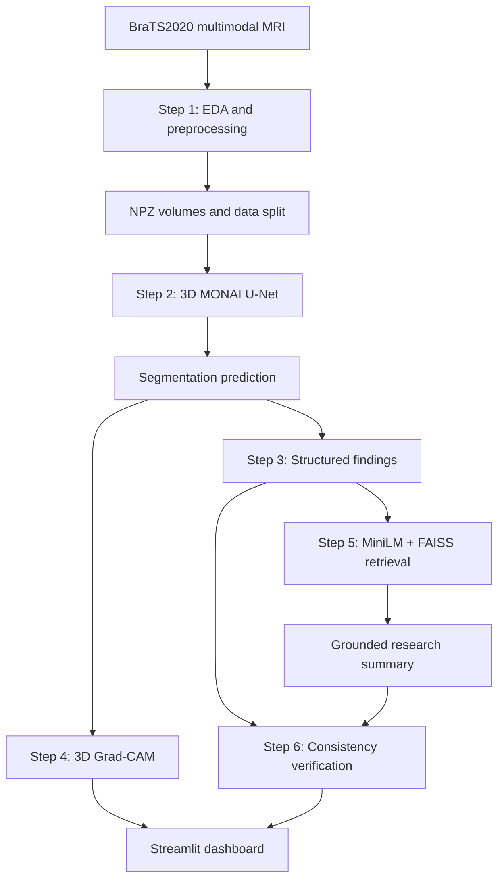

# NeuroExplain

### Explainable brain-tumor MRI segmentation with structured findings, retrieval-grounded research summaries, and consistency verification

NeuroExplain is an end-to-end capstone research prototype that turns multimodal brain MRI into an explainable analysis workflow. It segments tumor subregions, derives structured imaging features, visualizes model attention with 3D Grad-CAM, retrieves similar structured cases with FAISS, produces a grounded research summary, and verifies that the summary remains consistent with its source findings.

> **Research and education only.** NeuroExplain is not a medical device, clinical decision-support tool, or substitute for a qualified clinician. It must not be used for diagnosis, treatment, or patient care.

## Why NeuroExplain

Medical-AI outputs are difficult to trust when they stop at a segmentation mask. NeuroExplain connects the full chain of evidence:

```text
Multimodal MRI → Tumor segmentation → Structured findings → Grad-CAM evidence
        → Similar-case retrieval → Grounded research summary → Consistency check
```

## Capstone capabilities

| Stage | What it does | Key outputs |
|---|---|---|
| 1. Data and EDA | Validates BraTS case structure, visualizes MRI modalities and masks, normalizes/crops volumes, and creates reproducible data splits | EDA charts, compressed `.npz` volumes, `split.json` |
| 2. Segmentation | Includes a 2D U-Net baseline and a final 3D MONAI U-Net | Checkpoints, Dice/loss history, prediction overlays |
| 3. Structured findings | Derives tumor volumes, subregion ratios, centroid, laterality/location proxies, and a research-only severity rule | Per-case JSON and summary CSV |
| 4. Explainability | Creates 3D Grad-CAM, class-specific attention maps, overlap scores, and modality-ablation analysis | XAI panels, overlap tables, modality-importance visuals |
| 5. Retrieval and reporting | Embeds structured findings using MiniLM, retrieves similar cases with FAISS, and generates grounded research summaries | Retrieval tables and reports |
| 6. Verification | Parses report claims and checks them against the structured source fields | Consistency JSON, score charts, heatmaps |
| Dashboard | Provides an interactive Streamlit MRI, prediction, Grad-CAM, findings, report, and retrieval viewer | Local research dashboard |

## Architecture



## Tech stack

**Imaging and ML:** Python, PyTorch, MONAI, NiBabel, NumPy  
**Explainability:** 3D Grad-CAM, modality-ablation analysis  
**Retrieval:** Sentence Transformers (`all-MiniLM-L6-v2`), FAISS  
**Visualization:** Matplotlib, Streamlit  
**Data artifacts:** NIfTI, NPZ, JSON, CSV

## Project structure

```text
NeuroExplain/
├── steps/
│   ├── 01_data_eda_preprocessing.py
│   ├── 02a_unet2d_baseline.py
│   ├── 02b_unet3d_final.py
│   ├── 03_structured_findings.py
│   ├── 04a_gradcam_basic.py
│   ├── 04b_gradcam_enhanced.py
│   ├── 05_rag_reporting.py
│   └── 06_consistency_verification.py
├── common.py
├── run_pipeline.py
├── NeuroExplain_dashboard.py
├── requirements.txt
└── .env.example
```

Each stage loads the artifacts it needs from disk, so the workflow runs in VS Code without depending on Colab cell memory.

## Getting started

### 1. Obtain the data

Download the **BraTS2020 Training Dataset** from Kaggle or another authorized source, subject to its applicable terms. Keep the data outside this repository.

Expected case layout:

```text
BraTS2020_TrainingData/
└── BraTS20_Training_001/
    ├── BraTS20_Training_001_flair.nii
    ├── BraTS20_Training_001_t1.nii
    ├── BraTS20_Training_001_t1ce.nii
    ├── BraTS20_Training_001_t2.nii
    └── BraTS20_Training_001_seg.nii
```

### 2. Install dependencies

```bash
python -m venv .venv
source .venv/bin/activate  # Windows: .venv\\Scripts\\activate
pip install -r requirements.txt
```

### 3. Configure local paths

macOS/Linux:

```bash
export BRATS_DATASET_PATH="/absolute/path/to/BraTS2020_TrainingData"
export NEUROEXPLAIN_OUTPUT_PATH="outputs"
```

Windows PowerShell:

```powershell
$env:BRATS_DATASET_PATH="C:\\path\\to\\BraTS2020_TrainingData"
$env:NEUROEXPLAIN_OUTPUT_PATH="outputs"
```

### 4. Run the workflow

```bash
python run_pipeline.py
```

Run selected stages when iterating:

```bash
python steps/01_data_eda_preprocessing.py
python steps/02b_unet3d_final.py
python steps/03_structured_findings.py
python steps/04b_gradcam_enhanced.py
python steps/05_rag_reporting.py
python steps/06_consistency_verification.py
```

Launch the dashboard after the pipeline outputs exist:

```bash
streamlit run NeuroExplain_dashboard.py
```

## Local outputs

By default, generated artifacts are stored in `outputs/` on the user’s machine:

```text
outputs/
├── eda/
├── preprocessed_npz/
├── split.json
├── unet3d_best.pt
├── step3_structured_findings/
├── step4_xai/
├── step4_xai_enhanced/
├── step5_rag/
└── step6_consistency/
```

Raw MRI data, model checkpoints, generated case-level reports, and outputs are deliberately excluded from Git.

## Notes and limitations

- The 2D U-Net is retained as a baseline; the 3D MONAI U-Net drives downstream structured findings, XAI, retrieval, and verification.
- Location and severity fields are rule-based research proxies, not clinical conclusions.
- FAISS is an in-memory vector index. A database is not required for this local research workflow.
- Performance depends on hardware, dataset setup, and training duration. Use a CUDA-enabled GPU when available for practical 3D training.

## Author

**Prasad Adhau**  
MS Information Technology & Analytics, Rochester Institute of Technology
